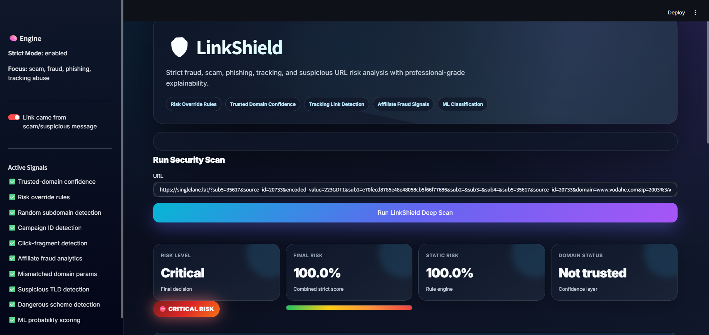

# 🛡️ LinkShield


**LinkShield** is a modern cybersecurity tool built to analyze suspicious URLs before you click.

It detects phishing, scam, fraud, tracking abuse, affiliate-abuse patterns, suspicious redirects, risky TLDs, and unusual URL structures using strict risk rules, machine learning, and explainable security findings.

---

## ✨ Preview

LinkShield includes a professional dark cyber-style dashboard with:

- 🧠 Strict risk engine
- 🛡️ Trusted-domain confidence
- 🚨 Critical / High / Medium / Low risk levels
- 🔍 URL feature analysis
- 📊 Machine-learning probability scoring
- 📋 Explainable security findings
- 🌐 Scam, phishing, tracking, and fraud pattern detection


<p align="center">
  
</p>

---

## 🚀 Features

### 🔐 Security Detection

- 🧪 Phishing URL detection
- 💸 Scam and fraud link analysis
- 📡 Tracking and campaign-link detection
- 🔁 Suspicious redirect-token detection
- 🎯 Click-fragment analysis
- 🧬 Random subdomain detection
- 🌍 Suspicious TLD detection
- 🧨 Dangerous URL scheme detection
- 🗂️ Risky file extension detection
- 🕵️ Affiliate-abuse pattern detection
- 🧾 Repeated, empty, and suspicious URL parameters
- 🌐 IP address detection inside URL parameters
- 🧩 Mismatched `domain=` parameter detection

### 🧠 Intelligence Engine

- 🤖 Machine-learning classification
- 🧱 Strict risk override rules
- ✅ Trusted-domain confidence
- 📊 Static URL feature extraction
- 🔎 Explainable security report
- ⚡ Fast local scanning

---

## 🧠 How LinkShield Works

LinkShield combines several detection layers:

### 1. Static URL Analysis

The URL is broken down into features such as URL length, domain structure, subdomain depth, query parameters, random-looking tokens, suspicious words, risky TLDs, encoded values, tracking IDs, and dangerous schemes.

### 2. Strict Risk Override Rules

Some combinations are too suspicious to stay low-risk.

For example:

- tracking domain + random subdomain + campaign IDs
- affiliate parameters + mismatched destination domain + IP tracking
- suspicious TLD + hash-like tracking value
- dangerous schemes like `javascript:` or `data:`

When these appear together, LinkShield forces the risk level higher.

### 3. Trusted-Domain Confidence

Normal links from trusted domains can be marked clearly as safer when their structure looks clean.

Examples:

- `google.com`
- `github.com`
- `microsoft.com`
- `wikipedia.org`
- `vodafone.de`
- `telekom.de`

### 4. Machine Learning

A local ML model is trained on URL features and gives an additional suspicious-link probability.

---

## 📦 Installation

### 1. Clone the repository

```bash
git clone https://github.com/YOUR_USERNAME/LinkShield.git
cd LinkShield
```

Replace `YOUR_USERNAME` with your GitHub username.

---

### 2. Create a virtual environment

#### Windows PowerShell

```powershell
py -3.12 -m venv .venv
.\.venv\Scripts\Activate.ps1
```

#### macOS / Linux

```bash
python3 -m venv .venv
source .venv/bin/activate
```

---

### 3. Install dependencies

```bash
python -m pip install --upgrade pip
python -m pip install -r requirements.txt
```

---

## 🧪 Train the Model

Before running the app, train the local machine-learning model:

```bash
python train.py
```

This creates a model file inside the `models/` folder.

---

## ▶️ Run the App

```bash
python -m streamlit run app.py
```

Then open:

```text
http://localhost:8501
```

---

## 🧪 Example URLs

### ✅ Normal-looking links

```text
https://www.google.com
https://github.com/login
https://www.wikipedia.org
https://www.vodafone.de
```

### 🚨 Suspicious links

```text
https://singlelane.lat/?sub5=35617&source_id=20733&encoded_value=223GDT1
https://randomtrackingdomain.example/s/token#?act=cl&pid=123456&uid=10
http://paypal-login-security-update.example.net/confirm-account
```

---

## 📁 Project Structure

```text
LinkShield/
│
├── app.py
├── train.py
├── requirements.txt
├── README.md
├── .gitignore
│
├── linkshield/
│   ├── __init__.py
│   ├── features.py
│   ├── model.py
│   └── risk.py
│
├── data/
│   └── sample_urls.csv
│
└── models/
    └── .gitkeep
```

---

## 🛠️ Tech Stack

- 🐍 Python
- 🎈 Streamlit
- 🤖 scikit-learn
- 📊 pandas
- 🔢 NumPy
- 🌐 tldextract
- 💾 joblib

---

## 🎯 Use Cases

LinkShield can be used for:

- cybersecurity portfolio projects
- phishing-awareness demonstrations
- scam-link analysis
- defensive URL inspection
- ML security experiments
- SOC-style prototype dashboards
- GitHub cybersecurity showcase projects

---

## ⚠️ Disclaimer

LinkShield is a defensive cybersecurity project.

No URL scanner can guarantee 100% accuracy. A low-risk result does not mean a link is absolutely safe, and a high-risk result should still be manually verified.

For production use, LinkShield should be combined with trusted threat-intelligence sources such as Google Safe Browsing, Microsoft Defender, VirusTotal, PhishTank, URLScan.io, or internal SOC feeds.

---

## 🧑‍💻 Author

Built by **Yazen Alsaho**.

---

## ⭐ Support

If you like this project, consider starring the repository on GitHub.

```text
Stay safe. Scan before you click.
```
